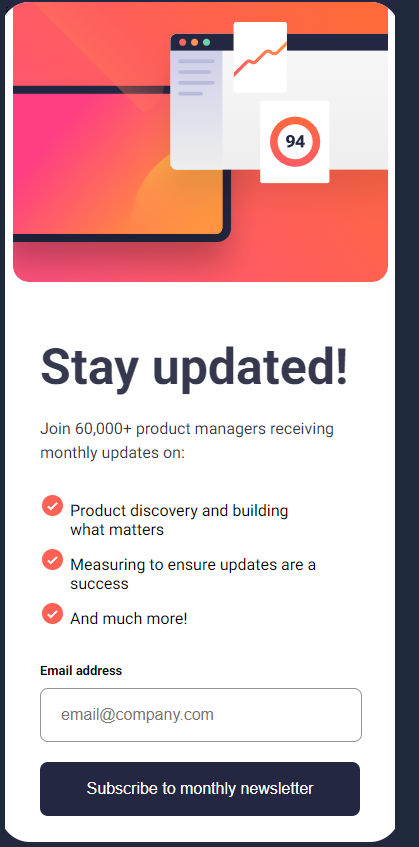
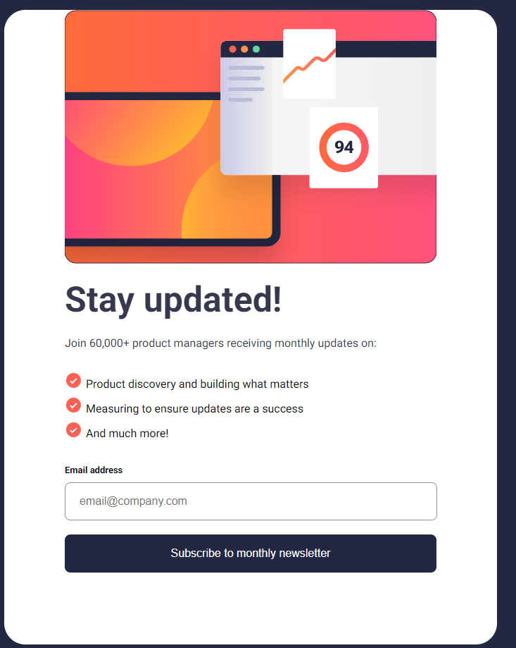

# Frontend Mentor - Newsletter sign-up form with success message solution

This is a solution to the [Newsletter sign-up form with success message challenge on Frontend Mentor](https://www.frontendmentor.io/challenges/newsletter-signup-form-with-success-message-3FC1AZbNrv). Frontend Mentor challenges help you improve your coding skills by building realistic projects.

## Table of contents

- [Overview](#overview)
  - [The challenge](#the-challenge)
  - [Screenshot](#screenshot)
  - [Links](#links)
- [My process](#my-process)
  - [Built with](#built-with)
  - [What I learned](#what-i-learned)
  - [Useful resources](#useful-resources)

## Overview

### The challenge

Users should be able to:

- Add their email and submit the form
- See a success message with their email after successfully submitting the form
- See form validation messages if:
  - The field is left empty
  - The email address is not formatted correctly
- View the optimal layout for the interface depending on their device's screen size
- See hover and focus states for all interactive elements on the page

### Screenshot





### Links

- Solution URL: [Add solution URL here](https://github.com/tortiman/newsletter_signUp_form)
- Live Site URL: [Add live site URL here](https://tortiman.github.io/newsletter_signUp_form/)

## My process

### Built with

- Semantic HTML5 markup
- CSS custom properties
- Flexbox
- Responsive design for desktop, mobile and tablet

### What I learned

Use the responsive design in all devices and javascript

```html
<h1>Some HTML code I'm proud of</h1>
```

```css
/*--- RESPONSIVE DESIGN ---*/
@media (min-width: 410px) and (max-width: 800px) {
  .form {
    width: 700px;
    height: 900px;
    display: flex;
    justify-content: start;
    align-items: center;
    flex-direction: column-reverse;
  }
  .form .form-text {
    width: 528px;
    display: flex;
    justify-content: center;
    align-items: start;
    flex-direction: column;
    padding: 0;
    gap: 20px;
    margin-top: 80px;
  }

  .form .form-text .email .email-address {
    width: 505px;
  }
  .form .container-image {
    padding: 0;
    height: 300px;
  }
  .form .image {
    content: url("/assets/images/illustration-sign-up-tablet.svg");
  }
}

@media (max-width: 400px) {
  .form {
    display: flex;
    flex-direction: column-reverse;
    overflow: hidden;
    justify-content: center;
    align-items: center;
    width: 400px;
    height: 840px;
  }

  .form .form-text {
    width: 80%;
    display: flex;
    justify-content: center;
    align-items: start;
    padding: 50px 20px 30px 20px;
  }

  .form-text .list {
    width: 80%;
  }
  .form .form-text .email .email-address {
    width: 298px;
  }

  .container-image {
    padding: 0;
    object-fit: cover;
  }

  .container-image img {
    padding: 0;
    content: url(/assets/images/illustration-sign-up-mobile.svg);
  }
}
```

```js
function emailValidator(email) {
  const regExpExpresion = /^[a-zA-Z0-9._%+-]+@[a-zA-Z0-9.-]+\.[a-zA-Z]{2,}$/;
  return regExpExpresion.test(email);
}

document.addEventListener("DOMContentLoaded", () => {
  console.log("Escribes en el textbox email");
  emailAddress = document.getElementById("emailId");
  buttonSubmit = document.getElementById("submitButton");
  buttonSubmit.addEventListener("click", () => {
    const texto = emailAddress.value;
    if (emailValidator(texto)) {
      console.log("email correcto");
      document.querySelector(".email-error").style.opacity = 0;
      document.querySelector(".email-error").style.visibility = "hidden";
      document.querySelector(".email-address").style.color = "hsl(0, 0%,58%)";
      document.querySelector(".email-address").style.border =
        "1px solid hsl(0, 0%,58%)";
      document.querySelector(".email-address").style.backgroundColor = "white";
      document.getElementById("formId").style.visibility = "hidden";
      document.getElementById("formId").style.opacity = 0;
      document.getElementById("successId").style.opacity = 1;
      document.getElementById("successId").style.visibility = "visible";
    } else {
      document.querySelector(".email-error").style.opacity = 1;
      document.querySelector(".email-error").style.visibility = "visible";
      document.querySelector(".email-address").style.color =
        "hsl(4, 100%, 67%)";
      document.querySelector(".email-address").style.border =
        "1px solid hsl(4, 100%, 67%)";
      document.querySelector(".email-address").style.backgroundColor =
        "#FFE8E6";
    }
  });

  emailAddress.addEventListener("keydown", (e) => {
    const texto = emailAddress.value;
    if (emailValidator(texto)) {
      console.log("email correcto");
      document.querySelector(".email-error").style.opacity = 0;
      document.querySelector(".email-error").style.visibility = "hidden";
      document.querySelector(".email-address").style.color = "hsl(0, 0%,58%)";
      document.querySelector(".email-address").style.border =
        "1px solid hsl(0, 0%,58%)";
      document.querySelector(".email-address").style.backgroundColor = "white";
    } else {
      document.querySelector(".email-error").style.opacity = 1;
      document.querySelector(".email-error").style.visibility = "visible";
      document.querySelector(".email-address").style.color =
        "hsl(4, 100%, 67%)";
      document.querySelector(".email-address").style.border =
        "1px solid hsl(4, 100%, 67%)";
      document.querySelector(".email-address").style.backgroundColor =
        "#FFE8E6";
    }
  });
});
```

### Useful resources

- [Regex](https://regex101.com/) - This helped me for learn regular expression.
